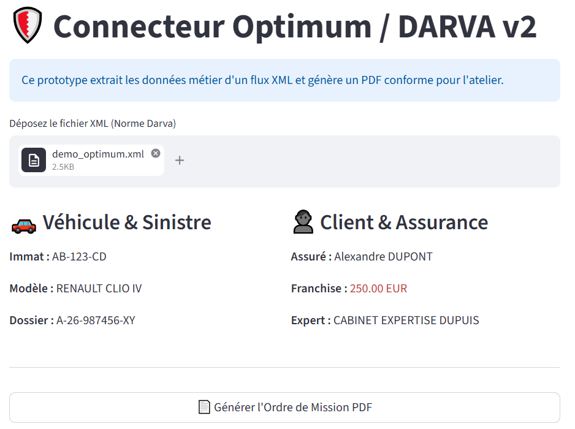
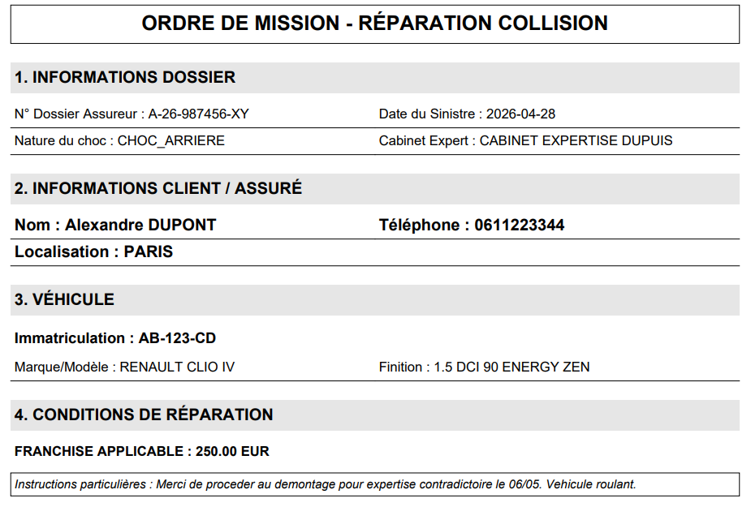

# 🚗 Connecteur XML DARVA/Optimum vers PDF

Ce projet est un prototype interactif développé avec **Streamlit**. Il permet de simuler la réception d'un flux XML d'assurance automobile (type Norme DARVA / Optimum), d'en extraire les informations métier clés via XPath, et de générer un Ordre de Mission structuré au format PDF.

## ✨ Fonctionnalités

- **Upload de fichier XML** : Interface drag & drop pour charger le flux.
- **Parsing ciblé** : Extraction robuste des données du client, du véhicule et du sinistre via XPath.
- **Visualisation métier** : Affichage synthétique des informations critiques (Immatriculation, Franchise, etc.) directement dans l'UI.
- **Génération PDF** : Création à la volée d'une fiche d'intervention téléchargeable (grâce à `fpdf2`).

## 📸 Aperçus

### Interface Streamlit

### PDF Généré

## 🛠️ Utilisation

Assurez-vous d'avoir Python installé sur votre machine. Il est recommandé d'utiliser un environnement virtuel.

1. Clonez ce repository.
2. `uv sync` Installez les dépendances python requises
3. `uv run streamlit run main.py` lancer l'app streamlit (ui)
4. Charger le fichier `input\demo_optimum.xml` pour la démo
